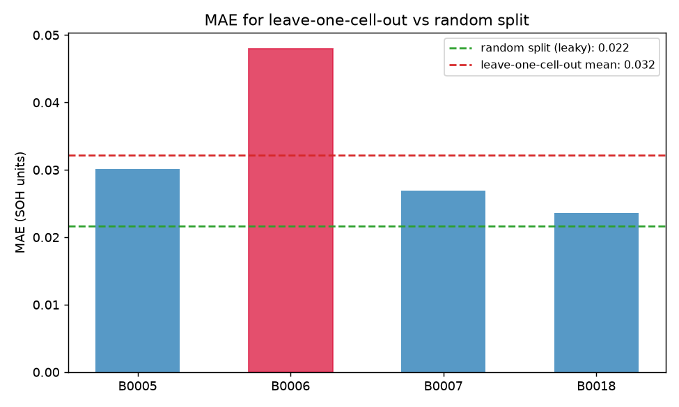

# ohm-battery-eval

A rough evaluation harness for battery state-of-health (SOH) prediction, built on the
NASA PCoE lithium-ion aging dataset (downloaded from Kaggle: https://www.kaggle.com/datasets/ckskaggle/li-ion-battery-dataset-from-nasa-pcoe). 
The point of this project is not the model itself- 
I did spend more time thinking about the evaluation: showing whether a degradation model is actually trustworthy,
or just looks good because it was measured the wrong way.

## Why I built this

To show how I ramp on an unfamiliar problem, I took public NASA cycling data and
built a critical layer: the data-quality and eval layer.
I put this together in ~ 1.5 days, navigating the battery
domain from scratch as I went.

## The core finding

I predict SOH from per-cycle sensor features using a very simple ridge
regression, then evaluate it two ways:

- **Random split of cycles (the naive way):** MAE ~0.022 SOH. Looks great.
- **Leave-one-cell-out (the honest way):** MAE ~0.032 SOH, and one held-out cell
  (B0006) was ~0.048, twice as bad as the best.

The naive split understates error by ~1.5x because cycles from the same cell are
nearly identical, so random splitting leaks nearly duplicate cycles across train and
test. The model recognizes neighbors (bc of autocorrelation) instead of predicting health. The honest
number holds out whole cells, which is what deployment actually looks like: a model
predicting SOH of a cell it never trained on.



## What the uncertainty says

With only 4 cells, leave-one-cell-out is a tiny experiment. A cell-level
bootstrap (resampling whole cells (not rows) for the same anti-leakage reason^^)
gives a 90% interval of roughly [0.013, 0.034] on MAE. That band is
wide, and it's mainly because B0006 is an outlier: whether it's in the sample
swings the average. So the honest conclusion isn't really "the model gets 0.03 error".
It's: "the methodology is sound, but 4 cells is too small of a sample size to claim a precise
accuracy number, and more cells is the first thing I'd want."

## What I'd do differently with real data and prod constraints

- **More cells.** 4 is not enough for generalization; the bootstrap
  interval makes that quantitative.
- **Feature cleanliness.** My mean-voltage feature includes a few post-cutoff
  relaxation samples (voltage recovers once the load is removed). Small and
  consistent across cells, so it doesn't affect the leave-one-cell-out contrast,
  but in prod, I might trim features to only where discharge current is flowing.
- **Richer features.** I used three summary features. The Severson et al. (2019)
  work shows the real signal lives in the shape of the discharge voltage curve; I'd
  extract curve-shape features (and likely do some kind of dimensionality reduction like PCA on them) with more time.
- **The deployment question.** I'd pair every prediction with its measured
  uncertainty, so an engineer sees "0.85 SOH, honest error ~0.03," not a bare number.

## What I deliberately did NOT do

- I did not remove capacity regeneration spikes (capacity recovering after rest).
  They look like noise but are real physics; cleaning them would destroy signal.
- I did not worry too much about model accuracy. The model is a simple ridge regressor on purpose-
  the evaluation strategies is what I focused more on.

## Data

NASA PCoE "Li-ion Battery Aging Datasets." Cells B0005, B0006, B0007, B0018 (one
test condition: ~24C, 2A discharge). Raw .mat files are not committed; download
from https://www.kaggle.com/datasets/ckskaggle/li-ion-battery-dataset-from-nasa-pcoe

## Repo layout

- `src/load_data.py` : parse raw .mat into one tidy row per discharge step
- `notebooks/00_explore_raw.ipynb` : raw data understanding (cycle types, curves, artifacts)
- `notebooks/01_build_table.ipynb` : the loader in action
- `notebooks/02_evaluation.ipynb` : the eval: random vs leave-one-cell-out, bootstrap
- `figures/` : saved plots

## Setup

\```bash
python3 -m venv .venv && source .venv/bin/activate
pip install -r requirements.txt
# download the four .mat files into data/raw/ (link above^), then run the notebooks
\```